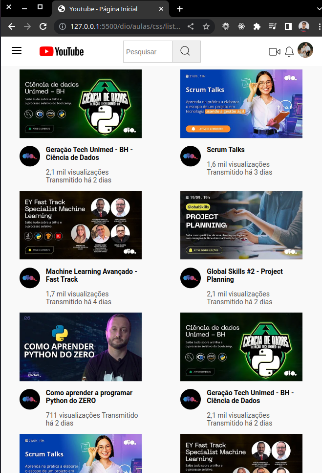

# Reproduzindo a listagem do Youtube com Grid Layout e barra de pesquisa com JavaScript

> Funcionalidades: Página com listagem de vídeos responsiva, barra de pesquisa e página de reprodução de vídeo.

Projeto desenvolvido para o desafio 3 da trilha de CSS da [DIO](https://www.dio.me), com objetivo de construir a Página de Listagem de vídeos no YouTube com CSS colocando em prática todos os conceitos aprendidos, principalmente sobre Grid Layout. Apoveitei para adicionar responsividade, uma barra de pesquisa funcionald utilizando JS e também uma página de reprodução de vídeos (ainda não responsiva).

## Deploy
[Link :rocket::rocket:](https://paulohmoreira.github.io/listagem-youtube/) 

# Screenshots

#### -Desktop

 

#### -Mobile

  
