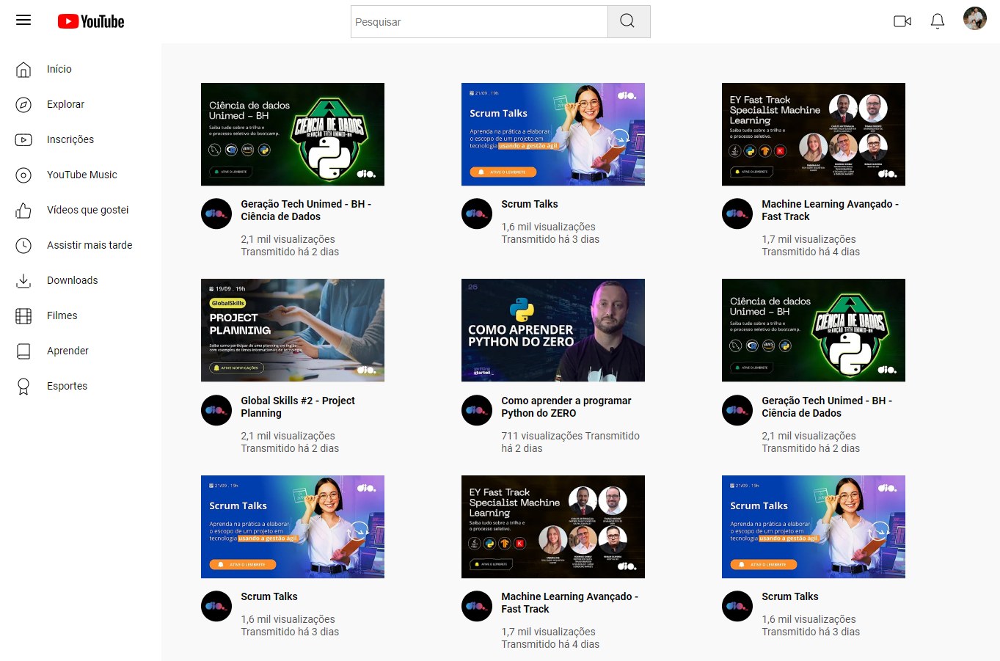
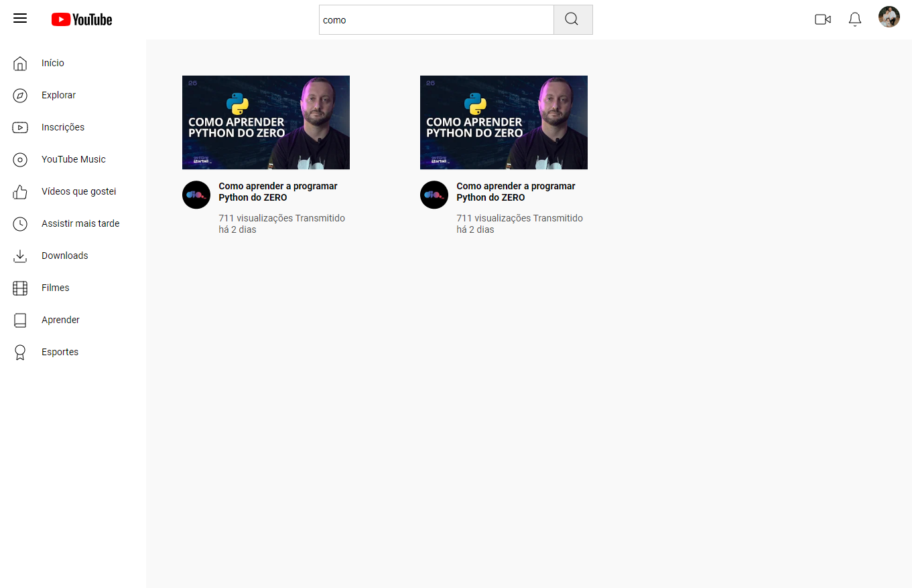

# Reproduzindo a listagem do Youtube com Grid Layout e barra de pesquisa com JavaScript

> Funcionalidades: Página com listagem de vídeos responsiva, barra de pesquisa e página de reprodução de vídeo.

## Deploy
[Link :rocket::rocket:](https://paulohmoreira.github.io/listagem-youtube/) 

# Screenshots

* Desktop

* Mobile

